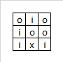
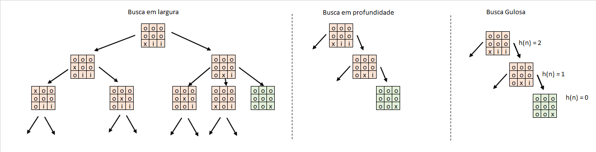

# C11 - Trabalho Prático 01

- O trabalho prático deverá ser feito em dupla.
- A realização da entrega deverá ser feita via Teams, através da tarefa adicionada à equipe.
- Atente-se ao prazo de entrega. Não será possível realizar a entrega após o prazo previsto.
- Apenas esse arquivo (`.ipynb`) com a resolução deverá ser entregue. Entregas em formato `.zip` serão penalizadas.
- Apenas 1 aluno da dupla deverá fazer a entrega e colocar o nome da dupla.

## Problema de Buscas

Considere um tabuleiro quadrado onde cada bloco pode estar limpo ("o") ou sujo ("i").
Seu trabalho é mover o aspirador "x" pelo tabuleiro a fim de limpar todos os blocos sujos.

- Sempre que o aspirador deixa um bloco, esse pode ser considerado como limpo.
- O objetivo é deixar todos espaços limpos (tabuleiro preenchido apenas com 'o' e com o aspirador 'x')
- Para responder às questões a, b, c, d basta completar os códigos

- Exemplo de Buscas

## Questão (a)

Implemente a Função de Busca em Largura (BFS)

## Questão (b)

Implemente a Função de Busca em Profundidade (DFS)

## Questão (c)

Implemente a Função de Busca Gulosa com a seguinte heurística:

`h(n) = nº de espaços com sujeira "i" (Minimizar a quantidade de estados com sujeira)`
